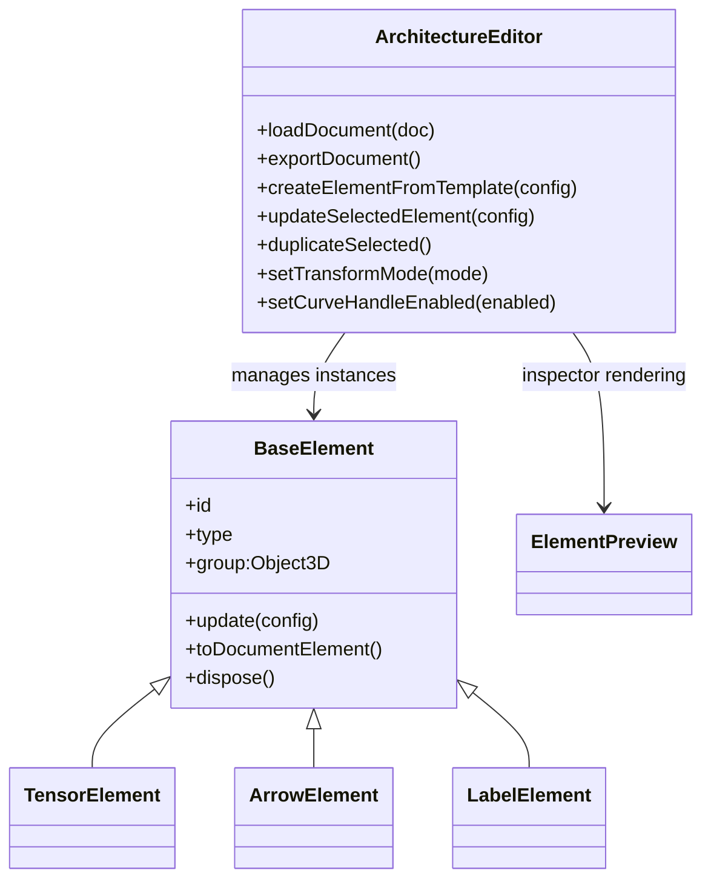

# Architecture Editor Refactor Plan

## Objective
Move hardcoded architecture topology out of application code into a user-editable JSON document, and provide drawio-style tooling to create, configure, move, rotate, duplicate, and re-edit architecture elements directly in the canvas.

## Scope Delivered
- Hideable left tool panel and hideable right inspector panel.
- Element creation flows for:
  - `tensor` (voxel volume with shape + styling controls)
  - `arrow` (`3d`, `2d`, `dotted`, `curved`)
  - `label` (text, font, size, color, background, border)
- Right inspector with live 3D preview.
- Add-to-canvas workflow that keeps the inspector open for repeated placement.
- Canvas selection + reconfiguration of existing elements.
- Transform tools for moving/rotating selected elements.
- Duplicate selected element.
- JSON export/import for full architecture persistence.

## Three.js Best-Practice Guidance Applied
Primary references used:
- [Object3D](https://threejs.org/docs/#api/en/core/Object3D)
- [Raycaster](https://threejs.org/docs/#api/en/core/Raycaster)
- [TransformControls](https://threejs.org/docs/#examples/en/controls/TransformControls)
- [InstancedMesh](https://threejs.org/docs/#api/en/objects/InstancedMesh)
- [How to dispose of objects](https://threejs.org/manual/#en/how-to-dispose-of-objects)

Design choices aligned to those docs:
- Composition over inheritance for scene graph: each user element is a dedicated `Object3D` subtree.
- Raycast-based selection by traversing intersected objects and resolving owning element IDs.
- `TransformControls` integrated with `OrbitControls` by toggling orbit while dragging.
- Voxel tensors remain instanced for efficiency (`TensorVolume`/`InstancedMesh`).
- Explicit disposal of geometries/materials/textures when rebuilding/removing elements.

## JSON Data Model
`versioned` document with scene metadata and an element array:

```json
{
  "version": 1,
  "scene": {
    "background": "#0f1624",
    "cameraPosition": [0, 0, 260]
  },
  "elements": [
    {
      "id": "tensor-...",
      "type": "tensor",
      "name": "Tensor",
      "transform": { "position": [0,0,0], "rotation": [0,0,0] },
      "data": { "shape": [3,3,3], "voxel": {}, "style": {} }
    }
  ]
}
```

Normalization rules are centralized in `src/editor/schema.js`:
- Enforces defaults and bounds for numeric fields.
- Applies per-type data defaults (`tensor`, `arrow`, `label`).
- Guarantees unique IDs.
- Produces stable output for import/export round-trip.

## OOP Design



Responsibilities:
- `ArchitectureEditor`: scene-level orchestration, selection, transforms, duplication, import/export.
- `BaseElement`: common lifecycle contract (`build`, `update`, `serialize`, `dispose`).
- `TensorElement`: wraps `TensorVolume` and tensor-specific style/data mapping.
- `ArrowElement`: generates 3D/2D/dotted/curved arrow geometry and curved-control APIs.
- `LabelElement`: builds sprite labels from configurable style properties.
- `ElementPreview`: isolated mini-renderer for inspector previews.

## UI Behavior Plan
- Left toolbox: create buttons, transform mode, duplicate, fit view, scene background, import/export.
- Right inspector: element-specific controls + live preview + add/apply action.
- Selection flow: clicking any element opens inspector in edit mode.
- Curved arrow flow: optional in-canvas control handle for mouse-based curve tuning.

## Implementation Notes
- Default starter document is `src/config/default-architecture.json`.
- Legacy pipeline classes remain in the repository but are no longer the app entry flow.
- New runtime entrypoint is JSON-driven (`src/main.js` + `src/editor/*`).

## Future Enhancements
- Box/lasso multi-select.
- Grouping and alignment commands.
- Undo/redo stack.
- Snap/grid constraints.
- Optional schema migrations for future document versions.
